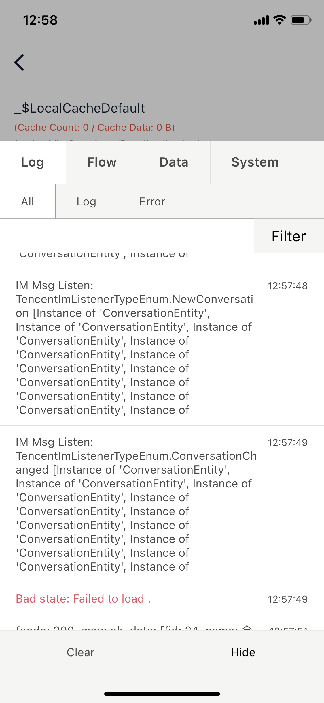
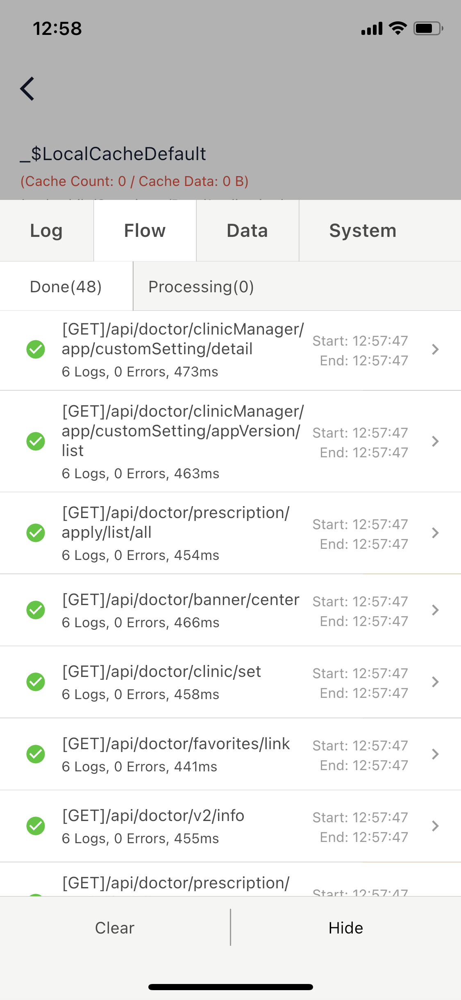
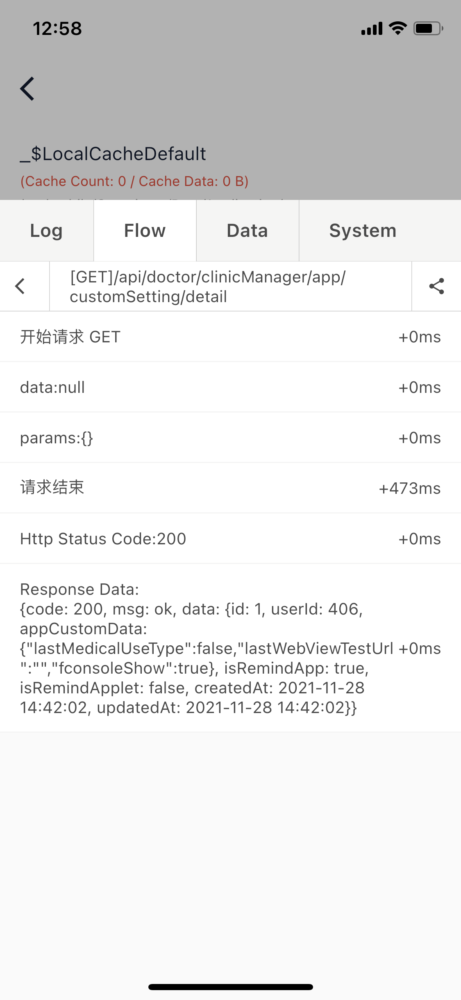

# fconsole

一个用于调试的面板组件，类似微信小程序的 v-console：在页面上创建一个可拖拽的悬浮窗，点击悬浮窗可启用 log 列表面板。

主要功能：

- 显示悬浮窗，随时打开 Log 页面
- 可自定义页面插入，项目专属调试页不用藏
- 使用 FlowLog 可记录流程事件，网络 Log 清晰可见
- 分享完整 FlowLog 网络请求，一键反馈(甩锅)后端报错

## 截图

<figure class="third">
    
    
    
</figure>

## 使用

```dart
// 同时拦截原生 print 函数和未捕获的异常
void main() => runAppWithFConsole(
      MyApp(),
      delegate: MyCardDelegate(),
      beforeRun: () async {
        WidgetsFlutterBinding.ensureInitialized();
        // Do some init before runApp
      }
    );
```

然后才可以使用下列方法：

### 启动悬浮窗

只需要调用顶层方法就可以打开悬浮窗

```dart
// 启动悬浮窗
showConsole();
// 隐藏悬浮窗
hideConsole();
```

### 自定义页面

很多时候我们都需要插入自定义页面，可以这样做：

```dart
/// More code in file: ./example/lib/main.dart
void main() => runAppWithFConsole(
      MyApp(),
      delegate: MyCardDelegate(),
    );

class MyCardDelegate extends FConsoleCardDelegate {
  @override
  List<FConsoleCard> cardsBuilder(DefaultCards defaultCards) {
    return [
      defaultCards.logCard,
      defaultCards.flowCard,
      /// Custom Page by
      FConsoleCard(
        name: "my",
        builder: (ctx) => CustomLogPage(),
      ),
      defaultCards.sysInfoCard,
    ];
  }
}

class CustomLogPage extends StatelessWidget {
  const CustomLogPage({Key key}) : super(key: key);

  @override
  Widget build(BuildContext context) {
    return Container(
      alignment: Alignment.center,
      child: Text('custom page content'),
    );
  }
}
```

卡片内无法使用OKToast，若要显示 toast 信息，FConsole提供了一个showMessage方法：

```dart
FConsole.showMessage("Copy Success");
```

### 拦截原生 print 函数和未捕获的异常

`fconsole`可以拦截原先的`print`函数，包括其他库中的`print`语句和未捕获的`throw`同样可以被拦截。

拦截后，`print`将等效于`FConsole.log`，未捕获的错误将等效于`FConsole.error`。

要使用此功能，请将`runApp`替换为`runFConsoleApp`:

```dart
void main() => runFConsoleApp(MyApp());
```

然后，原生`print`和`throw`将被拦截:

```dart
// 具体代码见example
SettingRow(
  icon: Icons.warning,
  text: '原生Print',
  right: Container(),
  onTap: () {
    print('${DateTime.now().toIso8601String()}');
  },
),
SettingRow(
  icon: Icons.warning,
  text: '原生Throw',
  right: Container(),
  onTap: () {
    throw '${DateTime.now().toIso8601String()}';
  },
),
```

### 添加 log

使用 FConsole 添加 log 非常简单：

```dart
// 添加log
FConsole.log("打印了一行log");
FConsole.log("打印了一行log");
FConsole.log("打印了一行log");
// 添加error
FConsole.error("打印了一行error");
FConsole.error("打印了一行error");
FConsole.error("打印了一行error");
FConsole.error("打印了一行error");
```

然后就可以在 FConsole 内查看 log 记录。

### 创建 FlowLog(未完成)

可以使用`FlowLog`的形式记录 Log:

```dart
FlowLog.of('分享启动').log('用户进入页面 $id');
FlowLog.of('分享启动').log('获取到分享值1 $shareId');
FlowLog.of('分享启动').log('查询分享信息1 成功');
FlowLog.of('分享启动').log('获取到分享值2 $shareId');
FlowLog.of('分享启动').log('查询分享信息2 成功');
FlowLog.of('分享启动').log('获取到分享值3 $shareId');
FlowLog.of('分享启动').log('查询分享信息3 成功');
FlowLog.of('分享启动').log('获取到分享值4 $shareId');
FlowLog.of('分享启动').error('查询分享信息4错误: $map');
FlowLog.of('分享启动').end();
```

也可以使用变量来记录

```dart
var logger = FlowLog.of('分享启动');
logger.log('用户进入页面 $id');
logger.log('获取到分享值 $shareId');
logger.error('查询分享信息错误: $map');
logger.end();
```

FlowLog 可以记录用户的一系列行为，在用户出现问题时，通过 Console 信息即可快速定位问题。

FlowLog 的优势在于，在同一页面上的操作可以分开记录，不会互相干扰，例如同时处理两张图片，一张成功而另一张失败，会按 id 形成两个不同的 FlowLog。

### FlowLog with Dio

一个很好的实践：使用 FlowLog 记录每一次网络请求

Tips: 使用“Share”可分享完整网络请求，一键反馈(甩锅)后端报错。

```dart
 _http = Dio();
_http!.interceptors.add(InterceptorsWrapper(
  onRequest: (RequestOptions options, handler) {
    var _logger = FlowLog.ofNameAndId(
      options.logId,
      id: '${options.hashCode}',
    );
    _logger.log('开始请求 ${options.method}');
    _logger.log('data:${options.data}');
    _logger.log('params:${options.queryParameters}');
    _logger.log('header:${options.headers.toString()}');
    handler.next(options);
  },
  onResponse: (e, handler) {
    var _logger = FlowLog.ofNameAndId(
      e.requestOptions.logId,
      id: '${e.requestOptions.hashCode}',
    );
    _logger.log('请求结束');
    _logger.log('Http Status Code:${e.statusCode}');
    _logger.log('Response Data:\n${e.data}');
    _logger.end();
    handler.next(e);
  },
  onError: (e, handler) {
    var _logger = FlowLog.ofNameAndId(
      e.requestOptions.logId,
      id: '${e.requestOptions.hashCode}',
    );
    _logger.error('请求错误:$e');
    _logger.end('请求错误结束');
    handler.next(e);
  },
));
```
